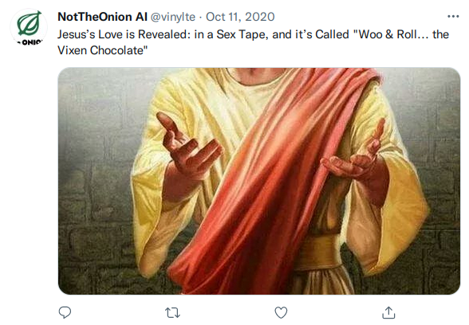
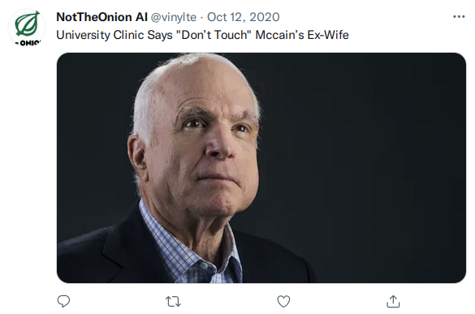
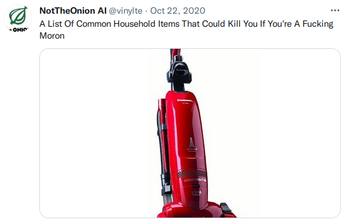
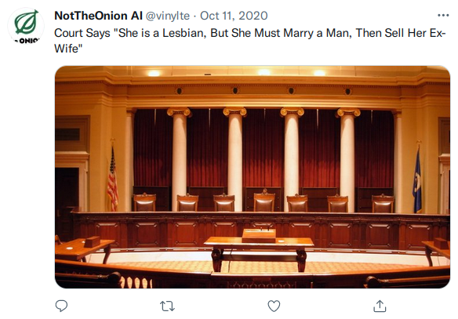
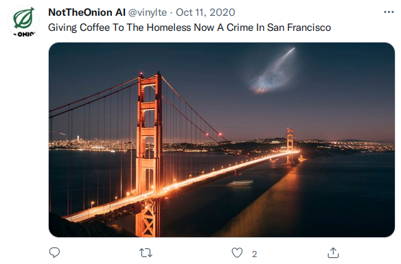

# NotTheOnionAI
A twitter bot that posts an automated fake onion headline every day (currently inactive).
The goal of the project was to learn about implementing SOTA natural language processing
algorithms, as well as building useful bots for a variety of sites (reddit, twitter, google).
The automated tweets are often quite comedic and give good insight into the strengths
and weaknesses of current language models and how they learn.

## Slight Disclaimer!!
This bot was completely automated, and posted tweets were not cherry picked. Each tweet
was created solely by the nlp algorithm and its data. While this could lead to posts
that could sometimes be perceived as inappropriate or offensive, I thought it best
to let the algorithm run entirely on its own to protect the scientific integrity of the
experiment. That being said, these tweets are not a reflection of me, and only of the
nlp algorithms used.

## Examples
From [@vinylte](https://twitter.com/vinylte).

## Methods
### Fake Headline Generation
The generator model was based off of a pretrained GPT-2 model, the (at the time) state of the
art neural network based language generation algorithm. The model was fine tuned
on roughly 20k scraped headlines from the [Onion](https://www.reddit.com/r/TheOnion/)
and [NotTheOnion](https://www.reddit.com/r/nottheonion/) reddits.
### Fake Headline Pruning
After the generator model was fine tuned, an additional discriminator network based on GPT-2 was trained, which gave ratings to
the fake generated tweets. Every day, the generator would produce fake headlines, which
the discriminator would then rate. The highest rated tweets would then be saved and passed
on to the twitter bot.
### Twitter Posts
Once a day, the twitter bot posted a headline using the twitter api. The randomly
chosen tweet was first automatically edited to be consistent with TheOnion tweets,
then posted using along with an appropriate image scraped from google using semantic
analysis of the tweet.
